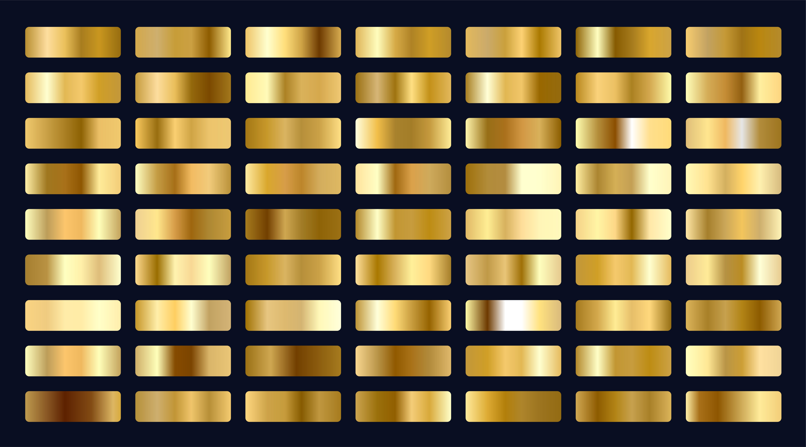

# Восстановление золота из руды

  

  

## Задача проекта
Спрогнозировать концентрацию золота при проведении процесса очистки золота.  

## Описание проекта  
Строитстся модель машинного обучения для промышленной компании, разрабатывающая решения для эффективной работы промышленных предприятий. Модель должна предсказать коэффициент восстановления золота из золотосодержащей руды на основе данных с параметрами добычи и очистки. Модель поможет оптимизировать производство, чтобы не запускать предприятие с убыточными характеристиками.  

## Навыки и инструменты  

## Этапы проекта
- Описание данных и загрузка
- Предобработка данных
- Анализ данных
- Функции для вычисления промежуточной и итоговой sMAPE
- Подготовка данных к построению моделей
- Обучение моделей. Этап Флотации.
- Обучение моделей. Этап Final.
- Проверка лучших моделей на тесте
- Вывод

  ## Вывод
  Лучший результат на флотации показала линейная регрессия с sMAPE = 6.26.  
  Лучший результат final показал Случайный лес sMAPE = 9.02. Итоговая sMAPE на train = 8.33.

  Итоговая sMAPE на test получилась хуже, чем на train 9.38 vs 8.33.

  Итоговая sMAPE наших лучших моделей на тесте получилась лучше, чем константной 9.38 vs 9.83.

  ## PS
  <a href="https://ru.freepik.com/free-vector/big-set-of-metallic-gold-gradients_5001177.htm#query=gold&position=0&from_view=search&track=sph">Изображение от starline</a> на Freepik
